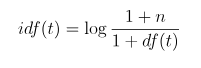
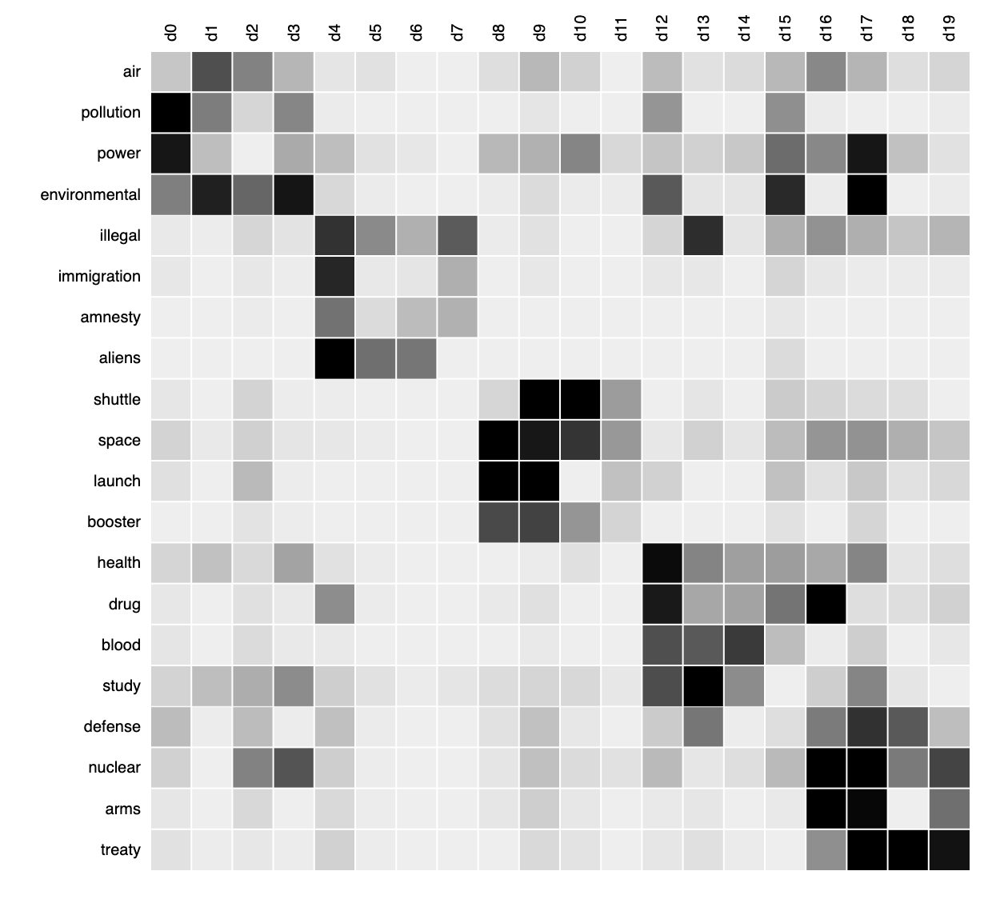

## 1.1 Propósito

Se procesan una serie de textos y se obtiene el top k palabras más importantes y se exporta una lista para construir una nube de palabras a través de un programa externo.

## 1.2 Metodología

#### 1.2.1 Limpieza:
- Convierte caracteres de utf8 a ascii y elimina errores.
- Convierte mayúsculas en miinúsculas y quita acentos.
- Elimina filas con entradas vacías.
- Se deshace de palabras con un número de carácteres menor a 3.
- Elimina stop [words](https://nlp.stanford.edu/IR-book/html/htmledition/dropping-common-terms-stop-words-1.html)

#### 1.2.2 Vectorización TF-IDF

- Genera un vectorizador de textos usando tf-idf.
- Obtiene los vectores de importancia de palabra cada texto.

Tf-idf significa *Term Frequency - Inverse Term Frequency*, tf-idf es utilizado en la recuperación de información y minería de texto. TF-idf es una medida estadística utilizada para evaluar la importancia de una palabra para un documento en una colección
de textos o corpus.[2]

En un corpus de texto grande, algunas palabras están muy presentes
(por ejemplo, "el", "a", "y"), por lo tanto, llevarán muy poca información sobre el contenido real del
documento. Si tuviéramos que alimentar los datos de conteo directamente a un
clasificador, esos términos muy frecuentes tendrían mucho peso comparado
con el peso de términos más raros pero más interesantes.[3]

Usando la configuración predeterminada de [TfidfTransformer](https://scikit-learn.org/stable/modules/generated/sklearn.feature_extraction.text.TfidfTransformer.html?highlight=tf%20idf#sklearn.feature_extraction.text.TfidfTransformer) de la libreriía Sci-Kit:

    TfidfTransformer(norm = 'l2', use_idf = True,
                     smooth_idf = True, sublinear_tf = False)

La frecuencia del término es decir, el número de veces que se produce un
término en un documento determinado, se multiplica con el componente idf, que
es calculado como:

>

#### Ejemplo

    Considere un documento que contiene 100 palabras en el que la palabra gato
    aparece 3 veces. El término frecuencia (es decir, tf) para gato es
    (3/100) = 0.03. Ahora, supongamos que tenemos 10 millones de documentos y
    la palabra gato aparece en mil de estos. La frecuencia inversa del
    documento (es decir, idf) se calcula como log(10,000,001 / 1,000+1) = 4.
    Por lo tanto, el peso Tf-idf es el producto de estas cantidades:
    0.03 * 4 = 0.12.

A continuación se muestra la matríz TF-IDF de un conjunto de documentos de
diferentes temas tales como "air", "pollution", etc. con un conjunto de palabras
etiquetadas como d0, d1, dn:

>
   Matríz de words-documents, cada columna corresponde a un documento, cada fila a una palabra. Una celda almacena la frecuencia de una palabra en un documento, las celdas oscuras indican altas frecuencias de palabras. La clusterización por topic Modelling agrupan los
   documentos, que usan palabras similares, así como las palabras que aparecen
   en un conjunto similar de documentos. Los patrones resultantes se
   denominan "temas" o "tópicos".

  Obtenido de: [http://www.issac-conference.org/2015/Slides/Moitra.pdf](http://www.issac-conference.org/2015/Slides/Moitra.pdf)

Finalmente se  extraen las  top-25 palabras para generar la   nubede palabras y las top-20 para un  análisis externo.
  #####  Dependencias

Los siguientes módulos son necesarios para ejecutar el código:

- joblib==0.14.0
- nltk==3.4.5
- numpy==1.17.4
- pandas==0.25.3
- python-dateutil==2.8.1
- pytz==2019.3
- scikit-learn==0.21.3
- scipy==1.3.3
- six==1.13.0
- sklearn==0.0

## 1.4 Resultados

Se extrajo el contenido semántico de los conjuntos de palabras y se realizó la nube de palabras en https://www.wordclouds.com.

Responsable: Daniel Bustillos (juan.bustillos@itdp.org)
### Referencias

[1] [https://nlp.stanford.edu/IR-book/html/htmledition/stemming-and-lemmatization-1.html](https://nlp.stanford.edu/IR-book/html/htmledition/stemming-and-lemmatization-1.html), visitado el 12/12/2019.

[2] [http://www.tfidf.com](http://www.tfidf.com), visitado el 12/12/2019.

[3] [https://scikit-learn.org/stable/modules/feature_extraction.html?highlight=tfid](https://scikit-learn.org/stable/modules/feature_extraction.html?highlight=tfidf), visitado el 12/12/2019.

[4] [https://mlexplained.com/2017/12/28/a-practical-introduction-to-nmf-nonnegative-matrix-factorization/](https://mlexplained.com/2017/12/28/a-practical-introduction-to-nmf-nonnegative-matrix-factorization/) , visitado el 11/12/2019.

[5] Blair, S.J., Bi, Y. & Mulvenna, M.D. Appl Intell (2019). https://doi.org/10.1007/s10489-019-01438-z
